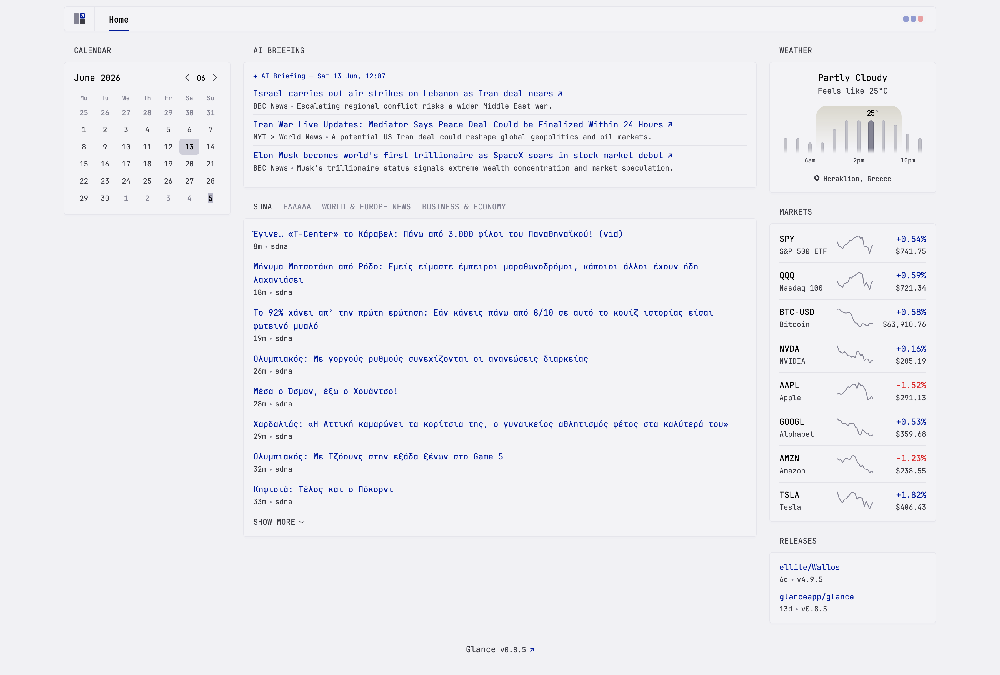

# AI News Briefing — Glance Extension

An AI-curated news briefing extension for [Glance](https://github.com/glanceapp/glance).
Fetches headlines from RSS feeds configured in Glance, asks an LLM to pick the
most significant stories, and serves styled HTML through Glance's extension protocol.



## Quick start

### 1. Install

```bash
pip install .
```

### 2. Set your API key

**DeepSeek (default):**
```bash
export LLM_PROVIDER=deepseek
export LLM_API_KEY=sk-...
```
Get a key at https://platform.deepseek.com/

**Google AI Studio:**
```bash
export LLM_PROVIDER=google
export LLM_API_KEY=...
```
Get a key at https://aistudio.google.com/

### 3. Run

```bash
briefing serve
```

The server starts on `http://127.0.0.1:8080`.

### 4. Add to Glance

In your Glance `glance.yml`:

```yaml
- type: extension
  url: http://localhost:8080
  allow-potentially-dangerous-html: true
```

That's it — sensible defaults cover everything. Glance passes any
``parameters`` you add as query-string overrides (see Configuration below).

## Docker

```bash
export LLM_PROVIDER=deepseek  # or: export LLM_PROVIDER=google
export LLM_API_KEY=sk-...
docker compose up -d
```

The compose file mounts ``~/glance-config`` read-only at ``/glance-config`` so the
extension can discover your RSS feeds. The Dockerfile sets
``GLANCE_CONFIG=/glance-config/config/home.yml`` as the container default.

## Configuration

**All settings are optional** — add them to the ``parameters`` block in
``glance.yml`` only when you want to override a default:

```yaml
- type: extension
  url: http://localhost:8080
  allow-potentially-dangerous-html: true
  parameters:
    story_count: 5
    model: deepseek-reasoner
    refresh_interval: 7200
```

Every parameter and its default:

| Parameter              | Default                                          | Notes                                                       |
|------------------------|--------------------------------------------------|-------------------------------------------------------------|
| ``model``              | ``deepseek-chat``                                | Model ID (varies by provider)                               |
| ``api_url``            | ``https://api.deepseek.com/v1/chat/completions`` | API endpoint (varies by provider)                           |
| ``temperature``        | ``0.3``                                          | LLM temperature                                             |
| ``timeout_seconds``    | ``30``                                           | API timeout in seconds                                      |
| ``story_count``        | ``3``                                            | Number of curated stories to return                         |
| ``headlines_per_feed`` | ``4``                                            | Headlines fetched per RSS feed                              |
| ``refresh_interval``   | ``14400``                                        | Seconds between refresh cycles (4 hours)                    |
| ``timezone``           | ``Europe/Athens``                                | Timezone to be reported under the widget                    |
| ``silent_hours_start`` | ``00:00``                                        | Skip briefing during [silent_hours_start, silent_hours_end] |
| ``silent_hours_end``   | ``08:00``                                        | Skip briefing during [silent_hours_start, silent_hours_end] |

The ``GLANCE_CONFIG`` environment variable sets the path to your Glance config
(for RSS feed discovery). Defaults to ``~/glance-config/config/home.yml``
(or ``/glance-config/config/home.yml`` in Docker via the Dockerfile).

Changing any parameter in ``glance.yml`` takes effect on the next refresh
cycle — no restart needed.

The ``LLM_PROVIDER`` environment variable selects the AI backend (``deepseek``
or ``google``). Defaults to ``deepseek``.

The ``LLM_API_KEY`` environment variable provides the API key for the selected
provider and should **not** be placed in ``glance.yml`` for security.

## CLI

```bash
briefing serve              # Start the HTTP server
briefing serve --port 9090  # Override port
briefing refresh            # Run pipeline once with defaults, print HTML, exit
briefing refresh --params "story_count=5&model=deepseek-reasoner"  # Override params
```

## Troubleshooting

| Symptom                     | Likely cause                                 | Fix                                                                                          |
|-----------------------------|----------------------------------------------|----------------------------------------------------------------------------------------------|
| Widget shows nothing        | API key not set                              | ``export LLM_API_KEY=sk-...``                                                               |
| ``api=error:http401``       | Wrong or expired API key                     | Check your API key for the selected provider                                                 |
| ``api=error:timeout``       | Network issue or AI provider down            | Wait for next refresh                                                                        |
| ``No RSS feeds configured`` | Glance config not found                      | Check ``glance_config`` default; override in ``parameters`` or via ``GLANCE_CONFIG`` env var |
| Feed changes not picked up  | Normal — feeds re-read on next refresh cycle | Wait up to ``refresh_interval`` seconds                                                      |
| Config changes not applied  | Normal — picked up on next refresh cycle     | Wait for the next refresh interval                                                           |
